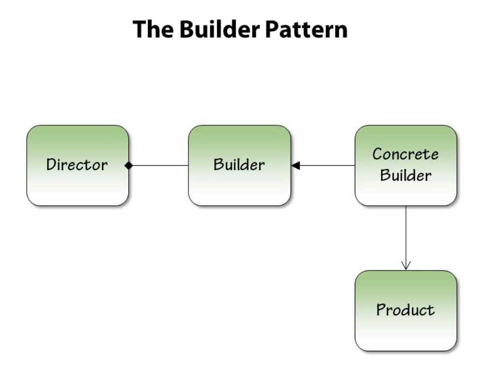
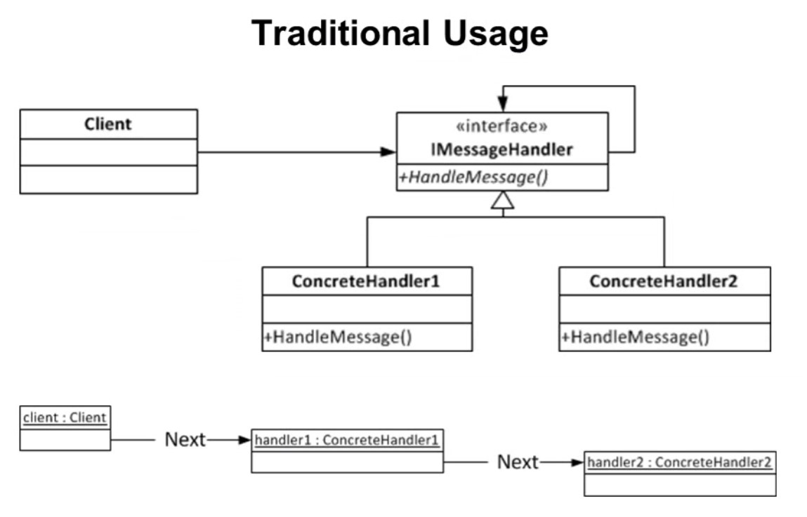
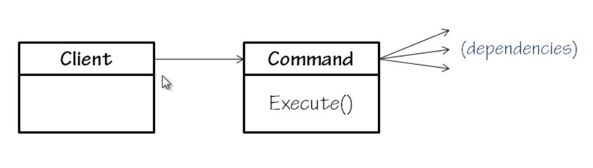
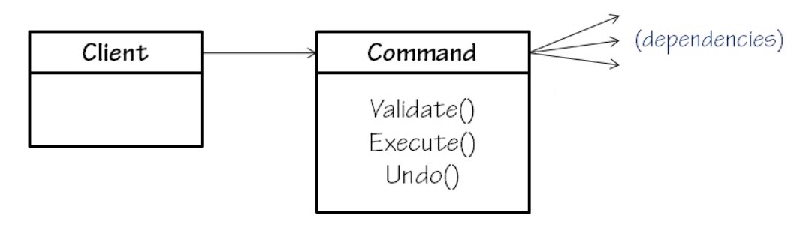
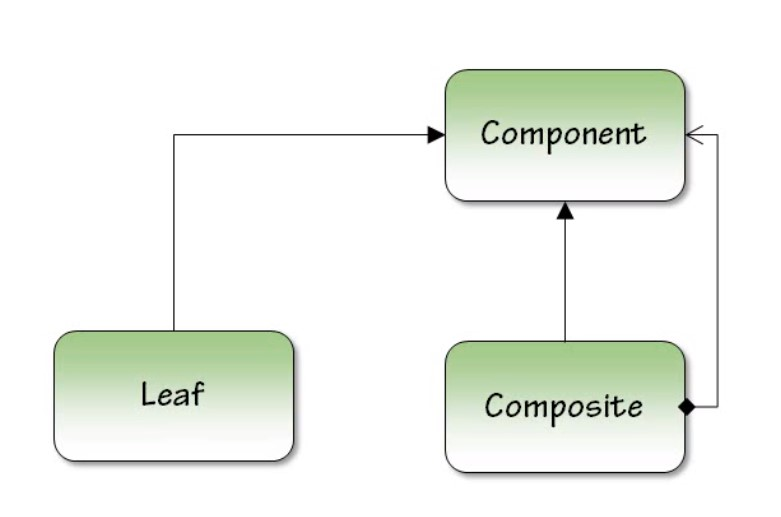
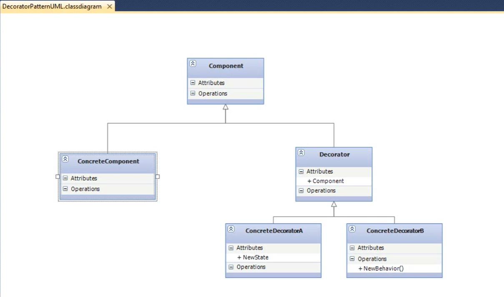

# Learning-CSharp
It includes projects, codes for all types of learning using c-sharp. 

## Learning.Algorithms
This includes learning for different types of algorithms. 

### Analysis of algorithms
Given two programs of same problem, how do we decide which one is better? We could take different approaches to decide which one is better. 

Feed different programs to a solution and find out the best program which is taking less time amongst all and passing all Test cases. Or we can take Asymptotic analysis. 
#### Asymptotic analysis 
Theoretical in nature. It measures order of growth in terms of input size. For example, we have Binary search and Linear search algorithms. Binary search takes logarithmic time of 100\*log(n) + 100 and Linear search takes Linear time of 2\*n + 3. Which one is better?
#### Asymptotic notations 
There are mathematical functions which denotes order of growth in terms of input size. 
+ **Theta(&theta;) notation:** This bounds a function from above and below, so it defines *exact* asymptotic behavior. &theta;(n2) tells us that highest order of equation can be n2 and not lower or higher than that. For example, 100\*n2 + 40 satisfies the equation, but 100\*n3 or 100\*n doesn't satisfy it.    
  <pre><code>&theta;(g(n)) = { f(n): there exist positive constants c1, c2 and n0 such that 
                     0 <= c1*g(n) <= f(n) <= c2*g(n) for all n >= n0 }</code></pre>
  The above definition means, if f(n) is theta of g(n), then the value f(n) is always between c1\*g(n) and c2\*g(n) for large values of n (n >= n0). The definition of theta also requires that f(n) must be non-negative for values of n greater than n0.
+ **Omega(Ω) notation:** This defines an lower bound of an algorithm, it bounds a function only from lower. Ω(n2) tells us that highest order of equation can be greater than or equal to n2. For example, 100\*n3 satisifies the equation, but 100\*n doesn't satisfy it.    
  Ω Notation can be useful when we have lower bound on time complexity of an algorithm. The Omega notation is the least used notation among all three.

  For a given function g(n), we denote by Ω(g(n)) the set of functions.
  <pre><code>Ω(g(n)) = { f(n): there exist positive constants c and n0 such that 
                     0 <= c*g(n) <= f(n) for all n >= n0 }</code></pre>
+ **Big-O(O) notation:** This defines an upper bound of an algorithm, it bounds a function only from above. O(n2) tells us that highest order of equation can be lower than or equal to n2. For example, 100\*n2 satisfies the equation, but 100\*3 doesn't satisfy it.    
  The Big O notation is useful when we only have upper bound on time complexity of an algorithm. Many times we easily find an upper bound by simply looking at the algorithm.    
  <pre><code>O(g(n)) = { f(n): there exist positive constants c and n0 such that 
                     0 <= f(n) <= c*g(n) for all n >= n0 }</code></pre>
#### Worst case, Average case and Best case 
We can have three cases to analyze an algorithm:
+ **Worst case analysis (Usually done):** In the worst case analysis, we calculate upper bound on running time of an algorithm. We must know the case that causes the maximum number of operations to be executed. 
+ **Average Case Analysis (Sometimes done):** In average case analysis, we take all possible inputs and calculate computing time for all of the inputs. Sum all the calculated values and divide the sum by total number of inputs. We must know (or predict) distribution of cases. 
+ **Best Case Analysis (Bogus):** In the best case analysis, we calculate lower bound on running time of an algorithm. We must know the case that causes minimum number of operations to be executed. 

#### Practice
As we know, Quick sort takes n2 in worst cases and n\*log(n) in other cases.     
+ Statement 1: Time complexity of Quick sort is &theta;(n2).   
  It is False, because in all cases time complexity of Quick sort is not n2. 
+ Statement 2: Time complexity of Quick sort is O(n2).   
  It is True, because in all cases time complexity is equal or less than n2. 
+ Statement 3: Time complexity of Quick sort is Ω(n\*log(n)).   
  It is True, because in all cases time complexity is equal or greater than n\*log(n). 

### Prime numbers

#### Methods
+ IsPrime(N)
    * Brute Force algorithm
    
       This iterates through each number(x) from 2 to number(N) itself and check if N is divisible by x. It breaks if N is divisible by x and returns false, otherwise returns true

            for x = 2 to N:
                if N is divisible by x:
                    return false
            return true

    * Sieve of Eratosthenes algorithm
    
        This iterates through number in range x(x), x(x+1), ... upto number(N) itself and mark them false. At the end return all numbers marked as true to get prime numbers. 

            1. Create a list of consecutive integers from 2 to N: (2,3,4,...,N)
            2. Initially, let p equal to 2, the first prime number.
            3. Starting from p*p, count up in increments of p and mark each of these numbers greater than or equal to p*p itself in the list. These numbers will be p(p+1), p(p+2), ... etc.
            4. Find the first number greater than p in the list that is not marked. if there was no such number, stop. Otherwise, let p now equal to this number (which is the next prime), and repeat from step 3.

+ GetPrimeNumbers(N)
    * Brute Force algorithm
    
        This iterates through each number(x) from 2 to number(N) itself and add to prime list if x is prime. After complete iteration, list will have all prime numbers in N

            list = empty list
            for x = 2 to N:
                if IsPrime(x):
                    add x to list
            return list

    * Sieve of Eratosthenes algorithm
        
        Refer in method [_IsPrime(N)'s_ __SieveOfEratosthenes__ algorithm](#methods) above.

+ GetPrimeNumbers(N1, N2)
    * Brute Force algorithm

        This iterates through each number(x) from N1 to number(N2) itself and add to prime list if x is prime. After complete iteration, list will have all prime numbers between N1 and N2

            list = empty list
            for x = N1 to N2:
                if IsPrime(x):
                    add x to list
            return list

    * Sieve of Eratosthenes algorithm
    
        Refer in method [_IsPrime(N)'s_ __SieveOfEratosthenes__ algorithm](#methods) above.

## Learning.DesignPatterns
This includes learning for different design patterns. 

### Builder pattern

#### Overview
This design pattern separates the construction of a complex object from its representation so that the same construction process can create different representations. 

#### Problems that builder pattern solves

+ Too many parameters in constructor
+ Order dependent, sets the process or steps to be followed to achieve final product
+ Different constructions, enables to pass different types of builder to get final product differently.

#### Roles

+ Director
    * Uses the **Concrete Builder**
    * Knows how to build
    * Client code calls directly
+ Builder
    * Abstract interface or class
    * Defines steps
    * Holds instance of **Product**
+ Concrete Builder
    * Should be more than one of these
    * Provides an implementation for interface defined by the **Builder**
    * A recipe
+ Product
    * What is being built
    * Not a different type, but different data

### Chain of responsibility Pattern

#### Traits
+ Sender is aware of only one receiver
+ Each receiver is only aware of the next receiver
+ Receivers process the message or send it down the chain
+ The sender does not know who received the message
+ The first receiver to handle the message terminates the chain
+ The order of the receiver list matters

#### Use the Chain of Responsibility when...
+ More than one message handler for a message
+ The appropriate handler is not explicitly known by the sender
+ The set of handlers can be dynamically defined

#### Benefits of the Chain of Responsibility
+ Reduced coupling
+ Dynamically manage the message handlers
+ End of chain behavior can be defined appropriately

#### Related patterns
+ Composite
+ Tree of responsibility

### Command Pattern

#### Intent

+ Represent an action as an object
+ Decouple clients that execute the command from the details and dependencies of the command logic
+ Enables delayed execution
  + Can queue commands for later execution
  + If command objects are also persistent, can delay across process restarts

#### Also known as
+ Action, Transaction

#### Applicability
+ Logging
+ Validation
+ Undo

#### Structure

**Taking it further**

#### Consequences
+ Commands must be completely self contained
  + The client doesn't pass in any arguments
+ Easy to add new commands
  + Just add a new class (open/closed principal)

#### Related patterns
+ Factory pattern
  + Factories are often useful to construct command objects
+ Null object
  + Often times returning a "Null command" can be useful instead of returning null
+ Composite
  + A Composite command can be useful
  + Construct it with several "child" commands
  + Execute() on the composite will call Execute() on the child commands

### Composite Pattern
#### Breaking it down
+ Compose objects into tree structures to represent part-whole hierarchies. Composite lets clients treat individual objects and composition of objects uniformly. 

#### When to use?
If we have in logic:
+ Groups or collections
+ Trees
+ Distribution
+ Can we add an interface?

### Decorator pattern or Wrapper pattern
#### Intent
+ Add functionality to existing objects dynamically.
+ Alternative to sub classing
+ Flexible design
+ Support Open Closed Principle (Open for Extension but Closed for modification)

#### When to use?
+ Legacy systems
+ Add functionality to controls
+ Sealed classes

#### Structure

#### How does it work?
+ It wrap objects

#### Consequences
+ The original object is unaware of any decorations
+ There is no one big feature-laden class with all the options in it
+ The decorations can be composed together in a mix-and-match fashion
+ Can increase complexity of code

#### Related patterns
+ Adapter
+ Bridge
+ Composite
+ Facade
+ Flyweight
+ Proxy

### Event Aggregator Pattern
#### Motivating example
+ An order entry system
+ Multiple screens
  + Order, Order Details, Order History, Shipping
+ Need to be notified
  + When an order is selected
  + When an order is created
  + When an order update is cancelled
  + When an order is saved
  + When an order is deleted

#### Intent
+ Simplify event registration by providing a single centralized store
+ Reduce coupling between publishers and subscribers
+ Reduce friction for introducing new events
+ Reduce memory management issues related to eventing

#### When to use?
+ You are bulding a composite application
+ You have complex screens
+ You have many publishers and subscribers
+ You have many events
+ New events are added frequently
+ Static events are a red flag

