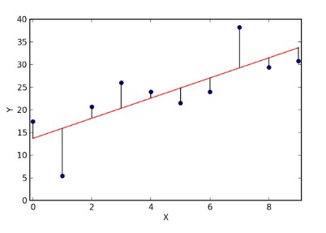

# Linear Regression
## Simple models for prediction

Let us start with making predictions using a few simple ways to start with. What could be the simplest way to predict the sales of an item?

### Model 1 - Mean Sales
If we have to predict sales for an item - it would be the average over last few days/weeks/months. But how good that model would be?        
There are various ways in which we can evaluate how good is our model. The most common way is **Mean Squared Error**.

**Prediction error:** The simplest way of calculating error is to calculate the difference between predicted and actual values. However, if we simply add them, they might cancel out, so we square these errors before adding. We also divide them by the number of data points to calculate a mean error since it should not be dependent on number of data points.   
     
This is known as the **Mean Squared Error**. Here e1, e2, ...., en are the difference between actual and predicted values. 
But this is not so cool to simply predict the average value. 

### Model 2 - Average sales by Location
We know that Location plays a vital role in the sales of an item. Therefore, let us use the location of item in dataset. So, basically calculate average sales for each location type and predict accordingly. This should reduce the error. Now, what if there are multiple features on which sales would depend on? How would we predict sales using this information? Linear Regression comes to our rescue. 

## Model 3 - Linear Regression (*Outlet_Establishment_Year*,*Item_MRP*)
### Introduction
Linear regression is the simplest and most widely used statistical technique for predictive modeling. It basically gives us an equation, where we have our features as independent variables, on which our target variable is dependent upon. Linear regression equation looks like this:   
<code>Y = &Theta;1X1 + &Theta;2X2 + ... + &Theta;nXn
</code>
Here we have Y as our dependent variable. X's are the independent variables and all &Theta;'s are the coefficients. *Coefficients are basically the weights assigned to the features, based on their importance.* Linear regression with only one feature, i.e., only one independent variable  has equation like,  
<code>Y = &Theta;1X + &Theta;0
</code>
This equation is called a Simple Linear Regression equation, which represents a straight line, where &theta;0 is Intercept, &theta;1 is the slope of line. 

### Best fit line
The main purpose of the best fit line is that our predicted values should be closer to our actual or the observed values. In other words, we tend to minimize the difference between the values predicted by us and the observed values, and which is actually termed as error. Graphical representation of error is as shown below. These errors are also called as residuals. The residuals are indicated by the vertical lines showing the difference between the predicted and actual value.    

How to calculate error?     
There are three ways in which we can calculate error:   
+ Sum of residuals(&sum;(Y - h(X))) - It might result in cancelling out of +ve and -ve errors.
+ Sum of absolute value of residuals(&sum;(|Y - h(X)|)) - absolute value would prevent cancellation of errors.
+ Sum of square of residuals(&sum;(Y - h(X))2) - Here we penalize higher error value much more as compared to a smaller one, so that there is a significant difference betweeb making big errors and small errors, which makes it easy to differentiate and select the best fit line. It is denoted by SSresiduals.
  

  where h(x) is the predicted value, y is the actual value, and m is the number of rows in the training set. **The Cost Function** which is basically used to define and measure the error of a model.      
  
  
  If you look at this equation carefully, it is just similar to sum of squared errors, with just a factor of 1/2m is multiplied in order to ease mathematics. So in order to improve our prediction, we need to minimize the cost function. For this purpose we use the gradient descent algorithm. So let us understand how it works.

### Gradient Descent Algorithm [Source](https://www.analyticsvidhya.com/blog/2017/03/introduction-to-gradient-descent-algorithm-along-its-variants/)
#### Introduction
Optimization basically means getting the optimal output for your problem. Optimization in ML has a slight difference. Generally, while optimizing, we know exactly how our data looks like and what areas we want to improve. But in ML we have no clue how our “new data” looks like, let alone try to optimize on it. So in ML, we perform optimization on the training data and check its performance on a new validation data.

#### What is Gradient Descent?
To explain Gradient Descent, I’ll use the classic mountaineering example.   
Suppose you are at the top of a mountain, and you have to reach a lake which is at the lowest point of the mountain (a.k.a valley). A twist is that you are *blindfolded* and you have zero visibility to see where you are headed. So, what approach will you take to reach the lake?      

The best way is to check the ground near you and observe where the land tends to descend. This will give an idea in what direction you should take your first step. If you follow the descending path, it is very likely you would reach the lake.

To represent this graphically, notice the below graph:      

Let us now map this scenario in mathematical terms.

Suppose we want to find out the best parameters (&theta;0) and (&theta;1) for our learning algorithm. Similar to the analogy above, we see and find similar mountains and valleys when we plot our *cost space*. Cost space is nothing but how our algorithm would perform when we choose a particular value for a parameter.

So on the y-axis, we have the cost J(&theta;0, &theta;1) against our parameters &theta;0 and &theta;1 on x-axis and z-axis respectively. Here, hills are represented by red region, which have high cost, and valleys are represented by blue region, which have low cost.

Gradient Descent algorithms can be classified by 2 methods mainly:  
+ **On the basis of data ingenstion:**
  + Full Batch Gradient Descent Algorithm    
    In full batch gradient descent algorithm, you use whole data at once to compute the gradient.
  + Stochastic Gradient Descent Algorithm    
    In stochastic gradient descent algorithm, you take a sample while computing the gradient.
+ **On the basis of differentiation techniques:**
  + First order Differentiation
  + Second order Differentiation    

  Gradient descent requires calculation of gradient by differentiation of cost function. We can either use first order differentiation or second order differentiation.

### Linear Regression Model generation
[Refer to Jupyter Notebook](BigMartSalesProblem/BigMartSales_Solution.ipynb#Linear-Regression-Model-Generation)

### Evaluate model
+ R-Square    
  It determines how much of the total variation in Y (dependent variable) is explained by the variation in X (independent variable). Mathematically, it can be written as:    
      
  The value of R-square is always between 0 and 1, where 
  + 0 means that the model does not explain any variability in the target variable(Y), and, 
  + 1 means that it explains full variability in the target variable(Y).    
  
  [R-Square example](BigMartSalesProblem/BigMartSales_Solution.ipynb#Model-Evaluation)    
  The only drawback of R2 is that if new predictors (X) are added to our model, R2 only increases or remains constant but it never decreases. We can not judge that by increasing complexity of our model, are we making it more accurate? That is why, we use *Adjusted R-Square*. 
+ Adjusted R-Square    
  It is the modified form of R-Square that has been adjusted for the number of predictors in the model. It incorporates model’s degree of freedom. The adjusted R-Square only increases if the new term improves the model accuracy.    
      
  where R2 = Sample R square, p = Number of predictors, N = total sample size

## Model 4 - Linear Regression with more variables
### Model generation
[Refer to Jupyter Notebook](BigMartSalesProblem/BigMartSales_Solution.ipynb#Model-4---Linear-Regression-with-more-variables)

### Model evaluation
[Refer to Jupyter Notebook](BigMartSalesProblem/BigMartSales_Solution.ipynb#Model-evaluation---R-square)    
Therefore we can see that the mse is further reduced. There is an increase in the value of R-square, does it mean that the addition of item weight is useful for our model?

## Model 5 - Linear Regression with all variables
### Model generation
[Refere to Jupyter Notebook](BigMartSalesProblem/BigMartSales_Solution.ipynb#Model-5---Linear-Regression-with-all-features)