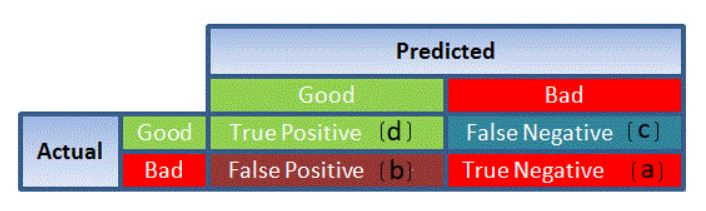

# Logistic Regression
## What is Logistic Regression?
Logistic Regression is a classification algorithm. It is used to predict a binary outcome (1 or 0, Yes or No, True or False) given a set of independent variables. To represent binary or categorical outcomes, we use dummy variables. In LogisticRegression, we are using *log of odds* as dependent variable. In simple words, it *predicts the probability of occurrence of an event by fitting data to a logit function*.

## Derivation of Logistic Regression Equation
Logistic Regression is part of a large class of algorithms known as a Generalized Linear Model(GLM).
The fundamental equation of generalized linear model is:

<code>g(E(y)) = &alpha; + &beta;x1 + &gamma;x2</code>

Here, g() is the link function, E(y) is the expectation of target variable and α + βx1 + γx2 is the linear predictor ( α,β,γ to be predicted). The role of link function is to 'link' the expectation of y to linear predictor.

Important points:

1. GLM does not assume a linear relationship between dependent and independent variables. However, it assumes a linear relationship between link function and independent variables in logit model.
2. The dependent variable need not to be normally distributed.
3. It uses Maximum Likelihood Estimation(MLE), and not uses OLS (Ordinary Least Square) for parameter estimation.
4. Errors need to be independent but not normally distributed.

## Example:
Suppose, we are provided a sample of 1000 customers. We need to predict the probability whether a customer will buy (y) a particular magazine or not. As you can see, we've a categorical outcome variable, so we'll use logistic regression.

To start with logistic regression, I'll first write the simple linear regression equation with dependent variable enclosed in a link function:

<code>g(y) = &beta;0 + β(Age)         ---- (a)</code>

*Note: For ease of understanding, I've considered 'Age' as independent variable.**

In logistic regression, we're only concerned about the probability of outcome dependent variable (success or failure). As described above, g() is the link function. This function is established using two things: 

+ Probability of Success(p), and 
+ Probability of Failure(1-p). 

`p` should meet following criteria:

+ It must always be positive (since p >= 0)
+ It must always be less than equal to 1 (since p <= 1)

Now, we'll simply satisfy these 2 conditions and get to the core of logistic regression. To establish link function, we'll denote g() with `p` initially and eventually end up deriving this function.

Since probability must always be positive, we'll put the linear equation in exponential form. For any value of slope and dependent variable, exponent of this equation will never be negative.

<code>p = exp(&beta;0 + &beta;(Age)) = e(&beta;0 + &beta;(Age))    ------- (b)</code>

To make the probability less than 1, we must divide `p` by a number greater than `p`. This can simply be done by:

<pre><code>p = exp(&beta;0 + &beta;(Age))/exp(&beta;0 + &beta;(Age)) + 1
  = e(&beta;0 + &beta;(Age))/e(&beta;0 + &beta;(Age)) + 1             ----- (c)</code></pre>

Using (a), (b) and (c), we can redefine the probability as:

<code>p = ey/(1 + ey)           --- (d)</code>

where p is the probability of success. This (d) is the Logit Function.

If p is the probability of success, 1-p will be the probability of failure which can be written as:

<code>q = 1 - p = 1 - (ey/ 1 + ey)    --- (e)</code>

where q is the probability of failure

On dividing, (d) / (e), we get:

After taking log on both side, we get:

log(p/(1-p)) is the *Link function*. Logarithmic transformation on the outcome variable allows us to model a non-linear association in a linear way.

After substituting value of y, we'll get:

This is the equation used in Logistic Regression. Here (p/1-p) is the **odd ratio**. Whenever the *log of odd ratio is found to be positive, the probability of success is always more than 50%*. 

A typical logistic model plot is shown below. You can see probability never goes below 0 and above 1.

## Performance of Logistic Regression model
To evaluate the performance of a logistic regression model, we must always look for:

1. **AIC (Akaike Information Criteria)** - The analogous metric of adjusted R² in logistic regression is AIC. AIC is the measure of fit which penalizes model for the number of model coefficients. Therefore, we always prefer model with minimum AIC value.
2. **Null Deviance and Residual Deviance** - Null Deviance indicates the response predicted by a model with nothing but an intercept. Lower the value, better the model. *Residual deviance* indicates the response predicted by a model on adding independent variables. Lower the value, better the model.
3. **Confusion Matrix**: It is nothing but a tabular representation of Actual vs Predicted values. This helps us to find the accuracy of the model and avoid overfitting. This is how it looks like:
   
   

   You can calculate the **Accuracy** of your model with:

   

   From confusion matrix, **Specificity** and **Sensitivity** can be derived as illustrated below:

   

4. **ROC Curve**: *Receiver Operating Characteristic(ROC)* summarizes the model's performance by evaluating the trade offs between true positive rate (sensitivity) and false positive rate(1- specificity). For plotting ROC, it is advisable to assume p > 0.5 since we are more concerned about success rate. ROC summarizes the predictive power for all possible values of p > 0.5.  The area under curve (AUC), referred to as index of accuracy(A) or concordance index, is a perfect performance metric for ROC curve. Higher the area under curve, better the prediction power of the model. Below is a sample ROC curve. The ROC of a perfect predictive model has TP equals 1 and FP equals 0. This curve will touch the top left corner of the graph.
   
   

