# ML (Machine Learning)
It includes Python notebooks related to MachineLearning.

## Data-Visualization-Python
This includes Python notebooks related to Data visualization using Python libraries.

## Mathematics for ML
We should already know concepts of:

+  Permutation
+  Combination
+  Conditional Probability

### Random variable
These are assigned as outcomes in terms of numbers of a Random process.

### Discrete Probability Distributions
#### The Bernoulli Distribution
These conditions should hold true for applying Bernoulli's Distribution:

+ A single trial
+ The trial can result in one of two possible outcomes, labelled success and failure
+ P(Success) = p
+ P(Failure) = 1 - p

Let `X = 1` if a success occurs, and `X = 0` if a failure occurs.
Then X(Random Variable) has a Bernoulli distribution:

<pre>
<code>P(X = x) = (p<sup>x</sup>)(1-p)<sup>1-x</sup></code>
</pre>

The **expected value** of a random variable is the theoretical mean of the random variable.

To calculate the expected value for a discrete random variable X:

<pre>
<code>E(X) = &sum;x*p(x) , for all x</code>
</pre>

Expectation of a function g(X):

<pre>
<code>E[g(X)] = &sum;g(x)*p(x) , for all x</code>
</pre>

Variance(&sigma;<sup>2</sup>) of X:

<pre>
<code>E[(X - &mu;)<sup>2</sup>] = &sum;(x-&mu;)<sup>2</sup>p(x) , for all x
E[(X - &mu;)<sup>2</sup>] = E(X<sup>2</sup>) - [E(X)]<sup>2</sup>
&sigma;<sup>2</sup> = E(X<sup>2</sup>) - &mu;<sup>2</sup></code>
</pre>

#### Example
Suppose 60% of American adults approve of the way the president is handling his job.  
Randomly sample 2 American adults.   
Let X represent the number that approve.
So X can take values of 0, 1 or 2.

The probability distribution of a discrete random variable X:

| x | 0 | 1 | 2 |
| :---: | :---: | :---: | :---: |
| p(x) | 0.16 | 0.48 | 0.36 |

*1. Expectation value of X or Mean of X*  
<pre>
<code>E(X) = &sum;x*p(x), for all values of x
     = 0*0.016 + 1*0.48 + 2*0.36
     = 1.2</code>
</pre>
E(X) is the theoretical mean(<code>&mu;</code>) of X.  

*2. Expectation value of <code>X<sup>2</sup></code>*     
<pre>
<code>E(X<sup>2</sup>) = &sum;x<sup>2</sup>*p(x), for all values of x
      = 0<sup>2</sup>*0.16 + 1<sup>2</sup>*0.48 + 2<sup>2</sup>*0.36
      = 1.92</code>
</pre>

*3. Variance of X, <code>&sigma;<sup>2</sup></code>*     
<pre>
<code>E[(X - &mu;)<sup>2</sup>] = &sum;(x-&mu;)<sup>2</sup>*p(x), for all values of x
            = (0 - 1.2)<sup>2</sup>*0.16 + (1 - 1.2)<sup>2</sup>*0.48 + (2 - 1.2)<sup>2</sup>*0.36
            = 0.48</code>
</pre>

We could also use following relationship to calculate *Variance of X*:      
<pre><code>E[(X - &mu;)<sup>2</sup>] = E(X<sup>2</sup>) - [E(X)]<sup>2</sup>
            = 1.92  - 1.2<sup>2</sup>
            = 0.48
</code></pre>

This [Cheatsheet on Probability](https://www.sas.upenn.edu/~astocker/lab/teaching-files/PSYC739-2016/probability_cheatsheet.pdf) provides a comprehensive reference material for probability & statistics. Developed by the University of Pennsylvania.

### Statistics
#### Inferential-Hypotheses Testing
*What is the Probability?*

+ It is the probability of an outcome given a state of nature.
+ It is not the probability of a state of nature.
+ Possible states of nature are called **Hypotheses** in statistics.

*Null Hypothesis*

<code>&mu;<sub>obese</sub> = &mu;<sub>average</sub></code>

*Alternate Hypothesis*

+ Null hypothesis:
    * <code>&mu;<sub>obese</sub> = &mu;<sub>average</sub></code>
+ Alternatives:
    * <code>&mu;<sub>obese</sub> < &mu;<sub>average</sub></code>
    * <code>&mu;<sub>obese</sub> \> &mu;<sub>average</sub></code>

Researchers Hope to Reject the Null Hypothesis

+ The null hypothesis is the opposite of the researcher's hypothesis
+ Researcher hopes to reject the null hypothesis to support his or her hypothesis

#### T-Test (Student's test)
**To be added later**

[Cheatsheet for Statistics](http://web.mit.edu/~csvoss/Public/usabo/stats_handout.pdf)

### Exploratory Data Analysis (EDA)
#### Introduction
There are no shortcuts for data exploration. If you are in a state of mind, that ML can sail you away from every data storm, trust me, it won't. After some point of time, you'll realize that you are struggling at improving model's accuracy. In such situation, data exploration techniques will come to your rescue.
#### Hypothesis generation
##### What is hypothesis generation?
This is a very important stage in DataScience/ML pipeline. It involves understanding the problem in detail by brainstorming as many factors as possible which can impact the outcome. It is done by understanding the problem statement thoroughly and before looking at the data. 

#### Steps of Data Exploration and Preparation
Remember the quality of your inputs decide the quality of your output. So, once you have got your business hypothesis ready, it makes sense to spend lot of time and efforts here. In general, data exploration, cleaning and preparation can take up to 70% of your total project time.    
Below are the steps involved to understand, clean and prepare your data for building your predictive model:

+ Variable Identification
+ Univariate Analysis
+ Bi-variate Analysis
+ Missing values treatment
+ Outlier treatment
+ Variable transformation
+ Variable creation

We need to re-iterate over steps 4-7 multiple times before we come up with our refined model. Let's now study each stage in detail:
##### 1. Variable Indentification
First, identify **Predictor**(*Input*) and **Target**(*Output*) variables. Next, identify the data type and category of the variables. 

Example: 
Suppose, we want to predict, whether the students will  play cricket or not(refer below data set). Here you need to identify predictor variables, target variable, data type of variables and category of variables. 

| Student\_ID | Gender | Prev\_Exam\_Marks | Height(cm) | Weight Category(kgs) | Play cricket |
| :---: | :---: | :---: | :---: | :---: | :---: |
| S001 | M | 65 | 178 | 61 | 1 |
| S002 | F | 75 | 174 | 56 | 0 |
| S003 | M | 45 | 163 | 62 | 1 |
| S004 | M | 57 | 175 | 70 | 0 |
| S005 | F | 59 | 162 | 67 | 0 |

Below, the variables have been defined in different category:

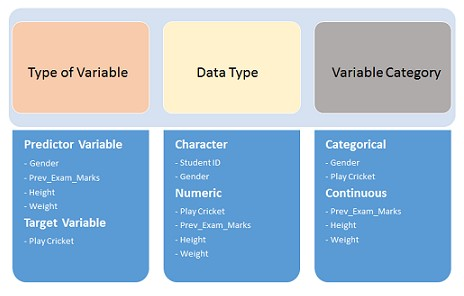

##### 2. Univariate Analysis
At this stage, we explore variables one by one. Method to perform uni-variate analysis will depend on whether the variable type is categorical or continuous. Let's look at these methods and statistical measures for categorical and continuous variables individually:   
**Continuous Variables**:- In case of continuous variables, we need to understand the central tendency and spread of the variable. These are measured using various statistical metrics visualization methods as shown below:
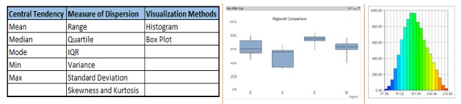

*Note: Univariate Analysis is also used to highlight missing and outlier values.*

**Categorical Variables**:- For categorical variables, we'll use frequency table to understand distribution of each category. We can also read as percentage of values under each category. It can be be measured using two metrics, **Count** and **Count%** against each category. **Bar chart** can be used as visualization.

##### 3. Bi-variate Analysis
Bi-variate analysis finds out the relationship between two variables. Here, we look for association and disassociation between variables at a pre-defined significance level. We can perform bi-variate analysis for any combination of categorical and continuous variables. The combinations are: 

+ **Categorical & Categorical**: To find the relationship between two categorical variables, we can use following methods:
  * **Two-way table**: We can start analyzing the relationship by creating a two-way table of count and count%. The rows represents the category of one variable and the columns represent the categories of the other variable. We show count or count% of observations available in each combination of row and column categories. 
  * **Stacked Column Chart**: This method is more of a visual form of Two-way table.  
  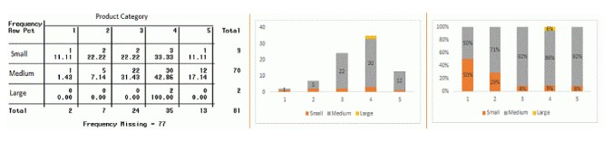
  * **Chi-Square Test**: This test is used to derive the statistical significance of relationship between the variables. Chi-square is based on the difference between the expected and observed frequencies in one or more categories in the two-way table. It returns probability for the computed chi-square distribution with the degree of freedom. Also, it tests whether the evidence in the sample is strong enough to generalize that the relationship for a larger population as well.
      + *Probability of 0*: It indicates that both categorical variable are dependent.
      + *Probability of 1*: It shows that both variables are independent.
      + *Probability &lt; 0.05*: It indicates that the relationship between the variables is significant at 95% confidence. The chi-square test statistic for a test of independence of two categorical variables is found by:    
      <code>X<sup>2</sup> = &sum;(O - E)<sup>2</sup> / E</code>, where O reprepsents Observer frequency and E is the expected frequency under the null hypothesis and computed by: 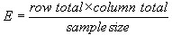 Statistical measures used to analyze the power of relationship are:
          - Cramer's V for Nominal Categorical Variable
          - Mantel-Haenszed Chi-Square for ordinal categorical variable.

+ **Categorical & Continuous**: While exploring between categorical and continuous variables, we can draw box plots for each level of categorical variables. If levels are small in number, it will not show the statistical significance. To look at the statistical significance we can perform Z-test, T-test or ANOVA.
  * **Z-Test/T-Test**:-Either test assess whether mean of two groups are statistically different from each other or not.    
  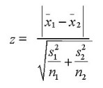

      If the probability of Z is small then the difference of two averages is more significant. The T-test is very similar to Z-test but it is used when number of observation for both categories is less than 30.     
      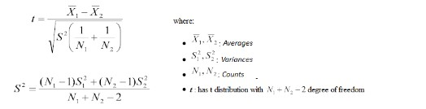
  * **ANOVA**:- It assesses whether the average of more than two groups is statistically different.
+ **Continuous & Continuous**: While doing bi-variate analysis between two continuous variables, we should look at scatter plot. The pattern of scatter plot indicates the relationship between variables. The relationship can be linear or non-linear.  
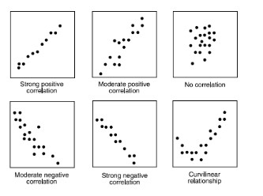    
Scatter plot shows the relationship between two variables but doesn't indicates the strength of relationship amongst them. To find the strength of the relationship, we use **Correlation**.  
Correlation varies between -1 and +1.   
  * -1: Perfect negative linear correlation
  * +1: Perfect positive linear correlation, and
  * 0: No Correlation    
Correlation can be derived using following formula:   
`Correlation = Covariance(X,Y) / SQRT(Var(X) * Var(Y))`

##### 4. Missing value treatment
**Why missing value treatment is required?**    
Missing data in the training data set can reduce the power/fit of a model or can lead to a biased model because we have not analysed the behavior and relationship with other variables correctly. It can lead to wrong prediction or classification.   
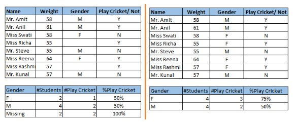   
Notice the missing values in the image shown above: In the left scenario, we have not treated missing values. The inference from this data set is that the chances of playing cricket by males is higher than females. On the other hand, if you look at the second table, which shows data after treatment of missing values (based on gender), we can see that females have higher chances of playing cricket compared to males.

**Why my data has missing values?**   
We looked at the importance of treatment of missing values in a dataset. Now, let's identify the reasons for occurrence of these missing values. They may occur at two stages:

+ Data Extraction
+ Data collection
  * Missing completely at random
  * Missing at random
  * Missing that depends on unobserved predictors
  * Missing that depends on the missing value itself

**Which are the methods to treat missing values?**

+ **Deletion:** It is of two types: *List Wise Deletion* and *Pair Wise Deletion*.
  * List wise deletion: We delete observations where any of the variable is misisng. Pros - *Simplicity*. Cons - *Reduces power of model because of smaller sample size*.
  * Pair wise deletion: We perform analysis with all cases in which the variables of interest are present. Pros - *Keeps all cases available for analysis*. Cons - *Uses different sample size for different variables*.
  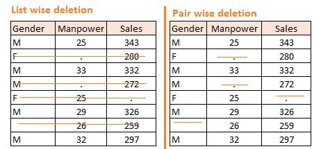
  * Deletion methods are used when the nature of misisng data is "**Missing completely at random**" else non random missing values can bias model output.
+ **Mean/Mode/Meadian imputation:** Imputation is a method to fill in the missing values with estimated ones. It consists of replacing the missing data for a given attribute by the mean or median (quantitative attribute) or mode (qualitative attribute) of all known values of that variable. It can be of two types:
  * **Generalized Imputation:** In this case, we calculate the mean or median for all non missing values of that variable then replace missing value with mean or median. 
  * **Similar case Imputation:** In this case, we calculate average for gender "Male" (29.75) and "Female" (25) individually of non missing values then replace the missing value based on gender. 
+ **Prediction Model:** We create a predictive model to estimate values that will substitute the missing data. We can use regression, ANOVA, Logistic regression and various modeling technique to perform this. There are 2 drawbacks for this approach:
  * The model estimated values are usually more well-behaved than the true values
  * If there are no relationships with attributes in the data set and the attribute with missing values, then the model will not be precise for estimating missing values.
+ **KNN Imputation:** In this method of imputation, the missing values of an attribute are imputed using the given number of attributes that are most similar to the attribute whose values are missing. The similarity of two attributes is determined using a distance function. It is also known to have certain advantage & disadvantages.
  * Advantages:
    - K-nearest neighbour can predict both qualitatitve and quantitaive attributes.
    - Creation of predictive model for each attribute with missing data is not required
    - Attributes with multiple missing values can be easily treated
    - Correlation structure of the data is taken into consideration
  * Disadvantages:
    - KNN algorithm is very time-consuming in analyzing large database. It searches through all the dataset looking for the most similar instances.
    - Choice of k-value is very critical. Higher value of k would include attributes which are significantly different from what we need whereas lower value of k implies missing out of significant attributes.

After dealing with missing values, the next task is to deal with outliers. Often, we tend to neglect outliers while building models. This is a discouraging practice. Outliers tend to make your data skewed and reduces accuracy.

##### 5. Outlier detection and treatment
###### What is an outlier?
Outlier is an observation that appears far away and diverges from an overall pattern in a sample. 

###### What are the types of outlier?
Outlier can be of 2 types: **Univariate**e and **Multivariate**. 

+ **Univariate outlier:** These outliers can be found when we look at distribution of a single variable. 
+ **Multivariate outlier:** These outliers are in n-dimensional space. For more information on Multivariate analysis, refer [here](https://python-for-multivariate-analysis.readthedocs.io/)

###### What causes Outliers?
Whenever we come across outliers, the ideal way to tackle them is to find out the reason of having these outliers. The method to deal with them would then depend on the reason of their occurrence. Causes of outliers can be classified in two broad categories:

+ Artifical (Error) / Non-natural
+ Natural

Let's understand various types of outliers in more detail:

+ Data entry errors
+ Measurement error
+ Experimental error
+ Intentional Outlier
+ Data processing error
+ Sampling error
+ Natural outlier

###### What is the impact of outliers on a dataset?
There are numerous unfavourable impacts of outliers in the data set:

+ It increases the error variance and reduces the power of statistical tests
+ If the outliers are non-randomly distributed, they can decrease normality
+ They can bias or influence estimates that may be of substantive interest
+ They can also impact the basic assumption of Regression, ANOVA and other statistical model assumptions.

To understand the impact deeply, let's take an example to check what happens to a data set with and without outliers in the data set. **Example:**    
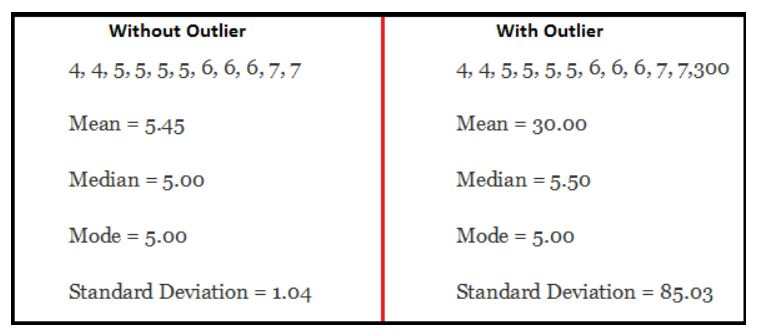
As you can see, data set with outliers has significantly different mean and standard deviation. In the first scenario, we will say that average is 5.45. But with the outlier, average soars to 30. This would change the estimate completely.

###### How to detect outliers?
We use visualization methods like **Box plot, Scatter plot, Histogram**. Some analysts use thumbrules to detect outliers. Some of them are:

+ Any value, which is beyond the range of -1.5 x IQR to 1.5 x IQR
+ Use capping methods. Any value which out of range of 5th and 95th percentile can be considered as outlier
+ Data points, three or more standard deviation away from mean are considered outlier
+ Outlier detection is merely a special case of the examination of data for influential data points and it also depends on the business understanding
+ Bivariate and multivariate outliers are typically measured using either an index of influence or leverage, or distance. Popular indices such as Mahalanobis’ distance and Cook’s D are frequently used to detect outliers.
+ In SAS, we can use PROC Univariate, PROC SGPLOT. To identify outliers and influential observation, we also look at statistical measure like STUDENT, COOKD, RSTUDENT and others.

###### How to remove outliers?
Most of the ways to deal with outliers are similar to the methods of missing values like deleting observations, transforming them, binning them, treat them as a separate group, imputing values and other statistical methods. Here, we will discuss the common techniques used to deal with outliers:

+ **Deleting observations:** We delete outlier values if it is due to data entry error, data processing error or outlier observations are very small in numbers. We can also use trimming at both ends to remove outliers.
+ **Transforming and binning values:** Transforming variables can also eliminate outliers. Natural log of a value reduces the variation caused by extreme values. Binning is also a form of variable transformation. Decision Tree algorithm allows to deal with outliers well due to binning of variable. We can also use the process of assigning weights to different observations.    
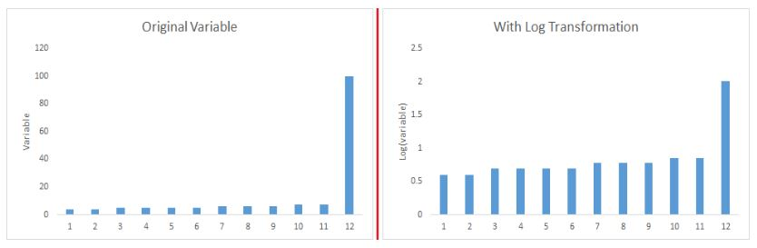
+ **Imputing:** We can use mean, median, mode imputation methods. Before imputing values, we should analyse if it is natural outlier or artificial. If it is artificial, we can go with imputing values. We can also use statistical model to predict values of outlier observation and after that we can impute it with predicted values.
+ **Treat separably:** If there are significant number of outliers, we should treat them separately in the statistical model. One of the approach is to treat both groups as two different groups and build individual model for both groups and then combine the output.

Till here, we have learnt about steps of data exploration, missing value treatment and techniques of outlier detection and treatment. These 3 stages will make your raw data better in terms of information availability and accuracy. Let's now proceed to the final stage of data exploration. It is Feature Engineering.  

##### 6. The Art of Feature Engineering
###### What is Feature Engineering?
Feature engineering is the science (and art) of extracting more information from existing data. You are not adding any new data here, but you are actually making the data you already have more useful.

###### What is the process of Feature Engineering?
You perform feature engineering once you have completed the first 5 steps in data exploration - Variable Identification, Univariate, Bivariate Analysis, Missing Values Imputation and Outliers Treatment. Feature engineering itself can be divided in 2 steps:

+ Variable transformation.
+ Variable/Feature creation.

These two techniques are vital in data exploration and have a remarkable impact on the power of prediction. Let's understand each of this step in more details.

**What is Variable Transformation?**

In data modelling, transformation refers to the replacement of a variable by a function. Transformation is a process that changes the distribution or relationship of a variable with others.

Let’s look at the situations when variable transformation is useful.

**When should we use Variable Transformation?**

Below are the situations where variable transformation is a requisite:

+ When we want to **change the scale** of a variable or standardize the values of a variable for better understanding. While this transformation is a must if you have data in different scales, this transformation does not change the shape of the variable distribution
+ When we can **transform complex non-linear relationships into linear relationships**. Existence of a linear relationship between variables is easier to comprehend compared to a non-linear or curved relation. Transformation helps us to convert a non-linear relation into linear relation. Scatter plot can be used to find the relationship between two continuous variables. These transformations also improve the prediction. Log transformation is one of the commonly used transformation technique used in these situations.   
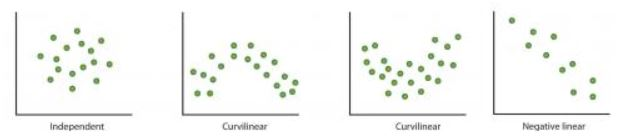
+ **Symmetric distribution is preferred over skewed distribution** as it is easier to interpret and generate inferences. Some modeling techniques requires normal distribution of variables. So, whenever we have a skewed distribution, we can use transformations which reduce skewness. For *right skewed distribution, we take square / cube root or logarithm of variable* and for *left skewed, we take square / cube or exponential of variables*.
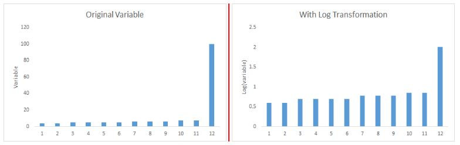
+ Variable Transformation is also done from an implementation point of view (Human involvement). Let's understand it more clearly. In one of the project on employee performance, we found that age has direct correlation with performance of the employee i.e. higher the age, better the performance. From an implementation stand point, launching age based progamme might present implementation challenge. However, categorizing the sales agents in three age group buckets of <30 years, 30-45 years and >45  and then formulating three different strategies for each group is a judicious approach. This categorization technique is known as **Binning of Variables**.

**What are the common methods of Variable Transformation?**

There are various methods used to transform variables. As discussed, some of them include square root, cube root, logarithmic, binning, reciprocal and many others. Let’s look at these methods in detail by highlighting the pros and cons of these transformation methods.

+ **Logarithm:** Log of a variable is a common transformation method used to change the shape of distribution of the variable on a distribution plot. It is generally used for reducing right skewness of variables. Though, It can’t be applied to zero or negative values as well.
+ **Square/Cube root:** The square and cube root of a variable has a sound effect on variable distribution. However, it is not as significant as logarithmic transformation. Cube root has its own advantage. It can be applied to negative values including zero. Square root can be applied to positive values including zero.
+ **Binning:** It is used to categorize variables. It is performed on original values, percentile or frequency. Decision of categorization technique is based on business understanding. For example, we can categorize income in three categories, namely: High, Average and Low. We can also perform co-variate binning which depends on the value of more than one variables.

**What is Feature / Variable Creation & its Benefits?**

*Feature/Variable creation* is a process to generate a new variables / features based on existing variable(s). For example, say, we have date(dd-mm-yy) as an input variable in a data set. We can generate new variables like day, month, year, week, weekday that may have better relationship with target variable. This step is used to highlight the hidden relationship in a variable:    
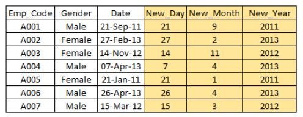

There are various techniques to create new features. Let’s look at the some of the commonly used methods:

+ **Creating derived variables:** This refers to creating new variables from existing variable(s) using set of functions or different methods. Let’s look at it through “Titanic - Kaggle competition”. In this data set, variable age has missing values. To predict missing values, we used the salutation (Master, Mr, Miss, Mrs) of name as a new variable. How do we decide which variable to create? Honestly, this depends on business understanding of the analyst, his curiosity and the set of hypothesis he might have about the problem. Methods such as taking log of variables, binning variables and other methods of variable transformation can also be used to create new variables.
+ **Creating dummy variables:** One of the most common application of dummy variable is to convert categorical variable into numerical variables. Dummy variables are also called *Indicator Variables*. It is useful to take categorical variable as a predictor in statistical models.  Categorical variable can take values 0 and 1. Let's take a variable 'gender'. We can produce two variables, namely, “Var_Male” with values 1 (Male) and 0 (No male) and “Var_Female” with values 1 (Female) and 0 (No Female). We can also create dummy variables for more than two classes of a categorical variables with n or n-1 dummy variables.   
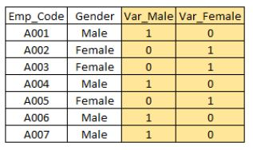

[Cheatsheet for data exploration](https://www.analyticsvidhya.com/blog/2015/06/infographic-cheat-sheet-data-exploration-python/)

### Linear Algebra
#### Matrix
**Matrix** is a way of writing similar things together to handle and manipulate them as per our requirements easily. In Data Science, it is generally used to store information like weights in an Artificial Neural Network while training various algorithms.

Technically, a matrix is a 2-D array of numbers (as far as Data Science is concerned). For example look at the matrix A below:

##### Terms related to matrix
+ **Order of matrix**: If a matrix has 3 rows and 4 columns, order of the matrix is 3*4 i.e. row*column.
+ **Square matrix**: The matrix in which the number of rows is equal to the number of columns.
+ **Diagonal matrix**: A matrix with all the non-diagonal elements equal to 0 is called a diagonal matrix.
+ **Upper triangular matrix**: Square matrix with all the elements below diagonal equal to 0.
+ **Lower triangular matrix**: Square matrix with all the elements above the diagonal equal to 0.
+ **Scalar matrix**: Square matrix with all the diagonal elements equal to some constant k.
+ **Identity matrix**: Square matrix with all the diagonal elements equal to 1 and all the non-diagonal elements equal to 0.
+ **Column matrix**:  The matrix which consists of only 1 column. Sometimes, it is used to represent a vector.
+ **Row matrix**:  A matrix consisting only of row.
+ **Trace**: It is the sum of all the diagonal elements of a square matrix.

#### Basic operations in matrix
+ Addition    
  Suppose we have 2 matrices ‘A’ and ‘B’ and the resultant matrix after the addition is ‘C’. Then:
  <code>C<sub>ij</sub> = A<sub>ij</sub> + B<sub>ij</sub></code>
+ Scalar multiplication   
  Multiplication of a matrix with a scalar constant is called *scalar multiplication*. Multiply each element of the matrix with the given constant. Suppose we have a constant scalar ‘c’ and a matrix ‘A’. Then multiplying ‘c’ with ‘A’ gives:
  <code>c[A<sub>ij</sub>] =  [c*A<sub>ij</sub>]</code>
+ Transposition   
  Transposition simply means interchanging the row and column index. For example:
  <code>A<sub>ij</sub><sup>T</sup>= A<sub>ji</sub></code>
  Transpose is used in vectorized implementation of linear and logistic regression.

``` python
import numpy as np 
import pandas as pd
# Create a 3*3 matrix 
A= np.arange(21,30).reshape(3,3)
#print the matrix A
array([[21, 22, 23], [24, 25, 26], [27, 28, 29]])
# Take the transpose
A.transpose()
array([[21, 24, 27], [22, 25, 28], [23, 26, 29]])
```

+ Matrix multiplication     
  Matrix multiplication is one of the most frequently used operations in linear algebra. We will learn to multiply two matrices as well as go through its important properties.

  Before landing to algorithms, there are a few points to be kept in mind:
  * The multiplication of two matrices of orders i*j and j*k results into a matrix of order i*k.  Just keep the outer indices in order to get the indices of the final matrix.
  * Two matrices will be compatible for multiplication only if the number of columns of the first matrix and the number of rows of the second one are same.
  * The third point is that order of multiplication matters.

``` python
import numpy as np
A=np.arange(21,30).reshape(3,3) 
B=np.arange(31,40).reshape(3,3)
A.dot(B)
AB= array([[2250, 2316, 2382], [2556, 2631, 2706], [2862, 2946, 3030]]) 
B.dot(A)
BA= array([[2310, 2406, 2502], [2526, 2631, 2736], [2742, 2856, 2970]])
```

  Properties of matrix multiplication:
  * Matrix multiplication is associative provided the given matrices are compatible for multiplication i.e.
    ABC = (AB)C = A(BC)
``` python
import numpy as np 
A=np.arange(21,30).reshape(3,3) 
B=np.arange(31,40).reshape(3,3) 
C=np.arange(41,50).reshape(3,3)
temp1=(A.dot(B)).dot(C)
array([[306108, 313056, 320004], [347742, 355635, 363528], [389376, 398214, 407052]])
temp2=A.dot((B.dot(C)))
array([[306108, 313056, 320004], [347742, 355635, 363528], [389376, 398214, 407052]])
```
  
  * Matrix multiplication is not commutative i.e. AB and  BA are not equal. 
  
  Matrix multiplication is used in linear and logistic regression when we calculate the value of output variable by parameterized vector method.

[Linear Algebra course on Khan Academy](https://www.khanacademy.org/math/linear-algebra)

### Simple models for prediction

Let us start with making predictions using a few simple ways to start with. What could be the simplest way to predict the sales of an item?

#### Model 1 - Mean Sales
If we have to predict sales for an item - it would be the average over last few days/weeks/months. But how good that model would be?        
There are various ways in which we can evaluate how good is our model. The most common way is **Mean Squared Error**.

**Prediction error:** The simplest way of calculating error is to calculate the difference between predicted and actual values. However, if we simply add them, they might cancel out, so we square these errors before adding. We also divide them by the number of data points to calculate a mean error since it should not be dependent on number of data points.   
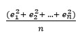     
This is known as the **Mean Squared Error**. Here e<sub>1</sub>, e<sub>2</sub>, ...., e<sub>n</sub> are the difference between actual and predicted values. 
But this is not so cool to simply predict the average value. 

#### Model 2 - Average sales by Location
We know that Location plays a vital role in the sales of an item. Therefore, let us use the location of item in dataset. So, basically calculate average sales for each location type and predict accordingly. This should reduce the error. Now, what if there are multiple features on which sales would depend on? How would we predict sales using this information? Linear Regression comes to our rescue. 

#### Linear Regression
Linear regression is the simplest and most widely used statistical technique for predictive modeling. It basically gives us an equation, where we have our features as independent variables, on which our target variable is dependent upon. Linear regression equation looks like this:   
<code>Y = &Theta;<sub>1</sub>X<sub>1</sub> + &Theta;<sub>2</sub>X<sub>2</sub> + ... + &Theta;<sub>n</sub>X<sub>n</sub>
</code>
Here we have Y as our dependent variable. X's are the independent variables and all &Theta;'s are the coefficients. *Coefficients are basically the weights assigned to the features, based on their importance.* Linear regression with only one feature, i.e., only one independent variable  has equation like,  
<code>Y = &Theta;<sub>1</sub>X + &Theta;<sub>0</sub>
</code>
This equation is called a Simple Linear Regression equation, which represents a straight line, where &theta;<sub>0</sub> is Intercept, &theta;<sub>1</sub> is the slope of line. 

##### Best fit line
The main purpose of the best fit line is that our predicted values should be closer to our actual or the observed values. In other words, we tend to minimize the difference between the values predicted by us and the observed values, and which is actually termed as error. Graphical representation of error is as shown below. These errors are also called as residuals. The residuals are indicated by the vertical lines showing the difference between the predicted and actual value.    
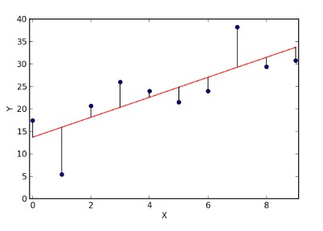

How to calculate error?     
There are three ways in which we can calculate error:   
+ Sum of residuals(&sum;(Y - h(X))) - It might result in cancelling out of +ve and -ve errors.
+ Sum of absolute value of residuals(&sum;(|Y - h(X)|)) - absolute value would prevent cancellation of errors.
+ Sum of square of residuals(&sum;(Y - h(X))<sup>2</sup>) - Here we penalize higher error value much more as compared to a smaller one, so that there is a significant difference betweeb making big errors and small errors, which makes it easy to differentiate and select the best fit line. It is denoted by SS<sub>residuals</sub>.
  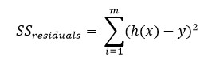

  where h(x) is the predicted value, y is the actual value, and m is the number of rows in the training set. **The Cost Function** which is basically used to define and measure the error of a model.      
  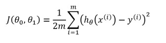
  
  If you look at this equation carefully, it is just similar to sum of squared errors, with just a factor of 1/2m is multiplied in order to ease mathematics. So in order to improve our prediction, we need to minimize the cost function. For this purpose we use the gradient descent algorithm. So let us understand how it works.
