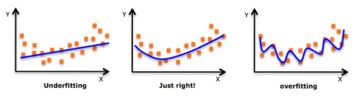
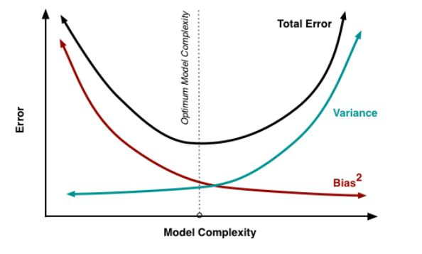
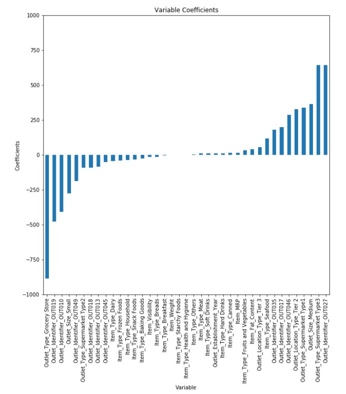

# ML (Machine Learning)
It includes Python notebooks related to MachineLearning.

## [Data-Visualization-Python](Data-Visualization-Python/Introduction_to_data_visualisation.ipynb)
This includes Python notebooks related to Data visualization using Python libraries.

## [Mathematics for ML](MathsForML_Readme.md)

## [Exploratory Data Analysis (EDA)](EDA_Readme.md)

## [Linear Regression](LinearRegression_Readme.md)

## Polynomial Regression
Polynomial regression is another form of regression in which the maximum power of the independent variable is more than 1. In this regression technique, the best fit line is not a straight line instead it is in the form of a curve. Quadratic regression, or regression with second order polynomial, is given by the following equation:

<code>Y =&theta;<sub>1</sub> +&theta;<sub>2</sub>\*x +&theta;<sub>3</sub>\*x<sup>2</sup></code>

So do you think it's always better to use higher order polynomials to fit the data set. Sadly, no. Basically, we have created a model that fits our training data well but fails to estimate the real relationship among variables beyond the training set. Therefore our model performs poorly on the test data. This problem is called as **over-fitting**. We also say that the model has **high variance** and **low bias**.



Similarly, we have another problem called **underfitting**, it occurs when our model neither fits the training data nor generalizes on the new data. Our model is underfit when we have **high bias** and **low variance**. 

## Bias and variance in Regression models
What does that bias and variance actually mean?

Let’s say we have a model which is very accurate, therefore the error of our model will be low, meaning a low bias and low variance. All the data points fit within the bull's-eye. Similarly, we can say that if the variance increases, the spread of our data point increases which results in less accurate prediction. And as the bias increases the error between our predicted value and the observed values increases. Now how this bias and variance is balanced to have a perfect model? Take a look at the image below and try to understand. 



As we add more and more parameters to our model, its complexity increases, which results in increasing variance and decreasing bias, i.e., overfitting. So we need to find out one optimum point in our model where the decrease in bias is equal to increase in variance. In practice, there is no analytical way to find this point. So how to deal with high variance or high bias? To overcome underfitting or high bias, we can basically add new parameters to our model so that the model complexity increases, and thus reducing high bias. Now, how can we overcome Overfitting for a regression model? Basically there are two methods to overcome overfitting:

+ Reduce the model complexity
+ Regularization

### Regularization
In regularization, what we do is normally we keep the same number of features, but reduce the magnitude of the coefficients. How does reducing the coefficients will help us? Let us take a look at the coefficients of feature in our regression model:
``` python
# Checking the coefficients of predictors
predictors = x_train.columns
coef = Series(model.coef_, predictors).sort_values()
coef.plot(kind='bar', title='Model Coefficients')
```



We can see that coefficients of *Outlet_Identifier_OUT027* and *Outlet_Type_Supermarket_Type3*(last 2) is much higher as compared to rest of the coefficients. Therefore the total sales of an item would be more driven by these two features. How can we reduce the magnitude of coefficients in our model? For this purpose, we have different types of regression techniques which uses regularization to overcome this problem.

## [Logistic Regression](LogisticRegression_Readme.md)